# Image Matching Algorithms

## Objective
The purpose of this project is to implement basic image matching algorithms and compare their performance in terms of detection accuracy.

---

## Task Description
1. Develop the program as outlined. Python and OpenCV libraries are utilized.
2. Compare the performance of two implementations in terms of detection accuracy.
3. Document results and upload the source code with a detailed README to GitHub.

---
# Execution:
## Theoretical Background

### Template Matching
Template Matching is a direct method of locating a template image within a larger input image using pixel correlation.

- **Strengths**: Simple to implement and execute.
- **Weaknesses**: Sensitive to scale, rotation, and lighting changes.

### SIFT (Scale-Invariant Feature Transform)
SIFT is a robust algorithm that detects and describes local image features.

- **Strengths**: Scale, rotation, and lighting invariant.
- **Weaknesses**: Computationally expensive.

---

## System Description
The system is implemented using Python with the OpenCV library. It comprises two methods:

### 1. Template Matching
- The `cv2.matchTemplate` function is used to match the template to the input image.
- Outputs a rectangle marking the highest correlation area.

### 2. SIFT (Scale-Invariant Feature Transform)
- Keypoints and descriptors are generated using `cv2.SIFT_create()`.
- Points are matched between the template and input image using the `cv2.BFMatcher`.
- Homography is calculated to map the template's location in the input image, marked by a bounding polygon.

---

## Testing and Results

### Results Overview

#### Template Matching Example:
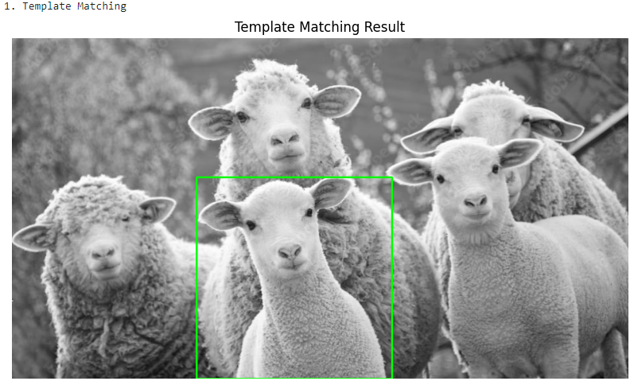

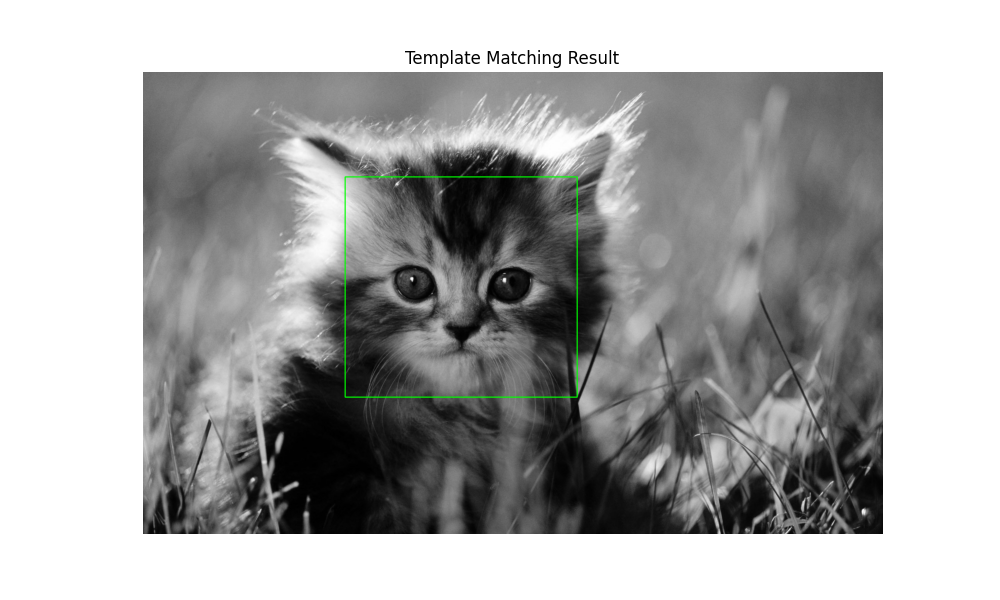
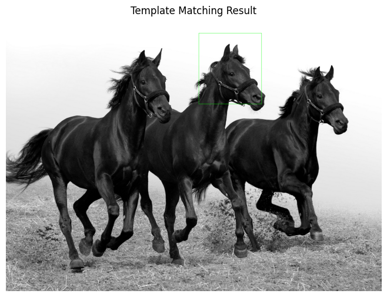

#### SIFT Example:
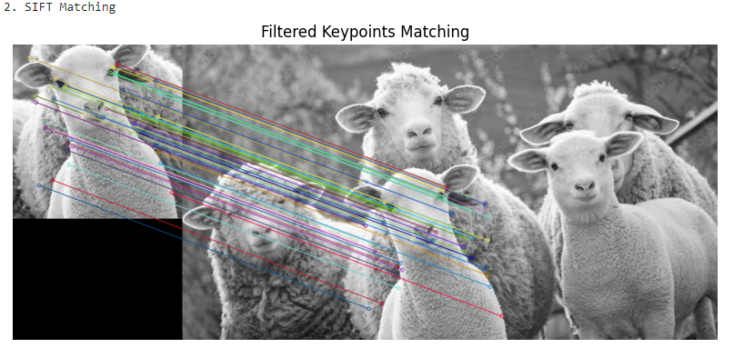
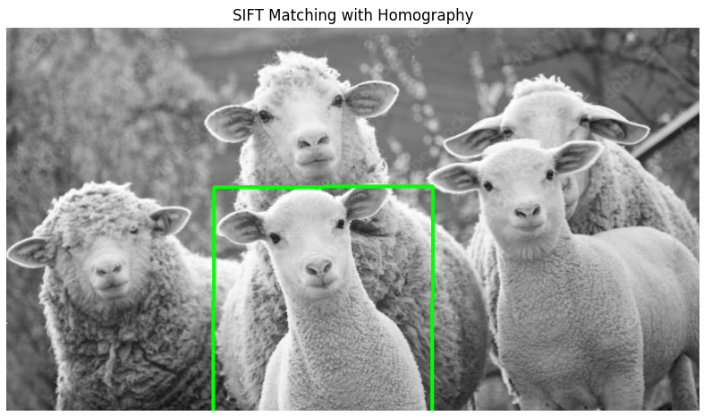
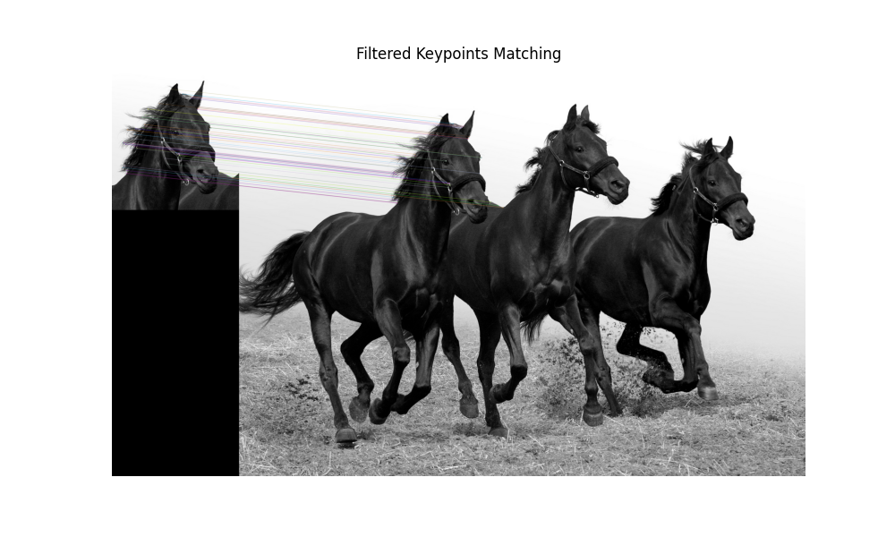
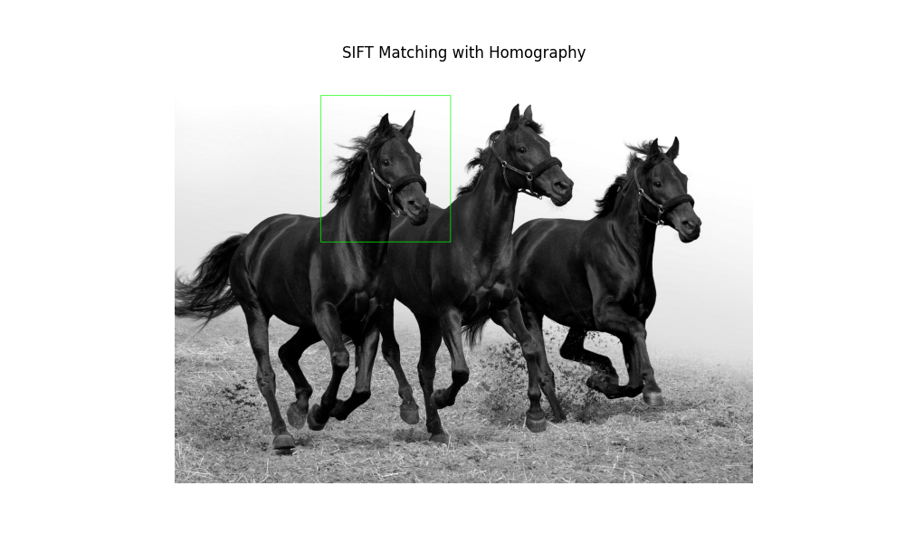
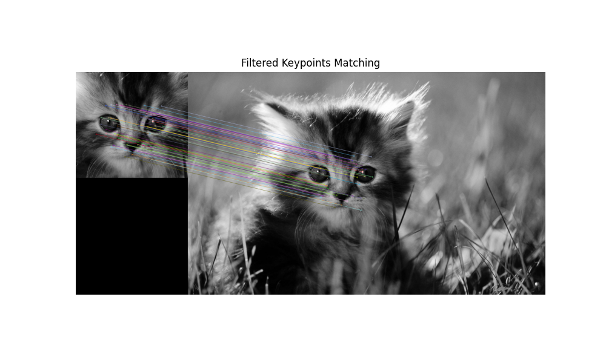

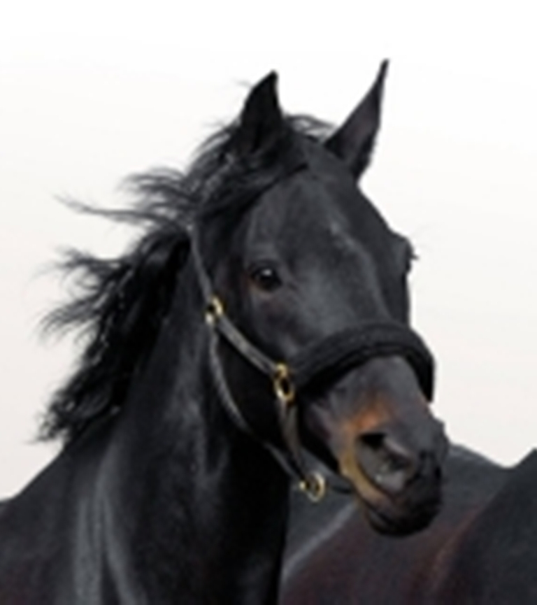
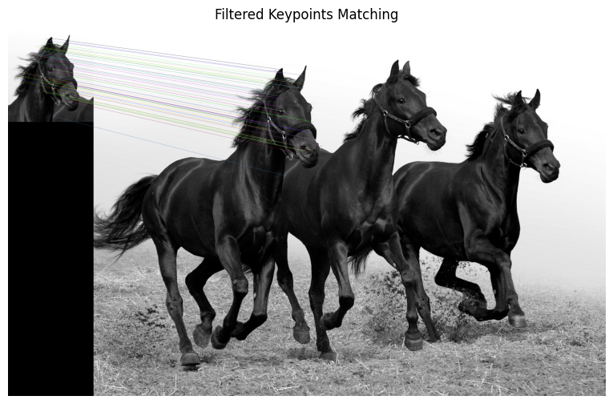
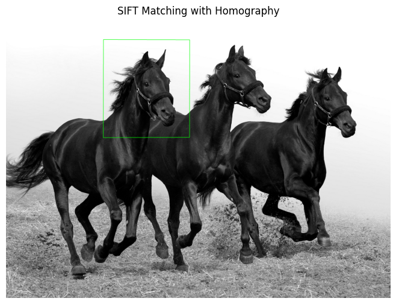

| Method               | Accuracy      | Execution Time | Robustness to Scale/Rotation |
|----------------------|---------------|----------------|------------------------------|
| **Template Matching** | Moderate      | High           | Low                          |
| **SIFT Matching**     | High          | Moderate       | High                         |

---

## Conclusions
- Template Matching is straightforward and efficient but struggles with variations in scale, rotation, and lighting.
- SIFT provides robust and reliable matching under complex conditions but requires more computational resources.

---

## References
- OpenCV Documentation: [https://docs.opencv.org/](https://docs.opencv.org/)
- Lowe, D.G. (1999). *Object Recognition from Local Scale-Invariant Features*: [Read the Paper](https://www.cs.ubc.ca/~lowe/papers/ijcv04.pdf)
- Matplotlib Documentation: [https://matplotlib.org/](https://matplotlib.org/)
